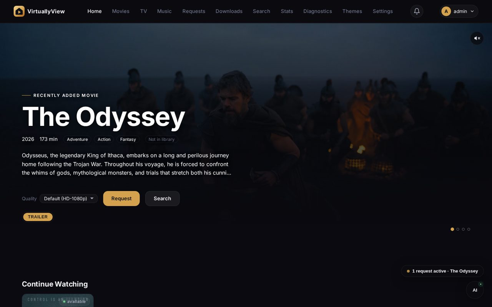
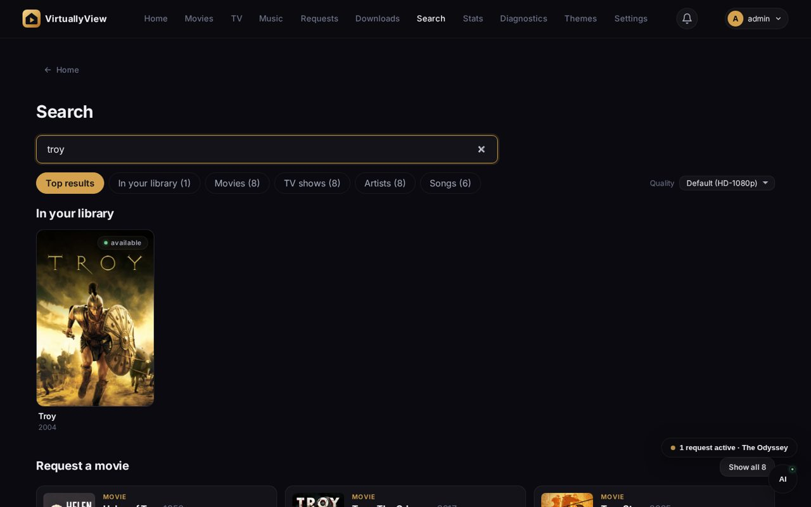
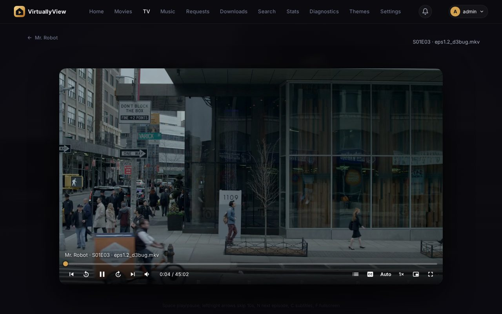
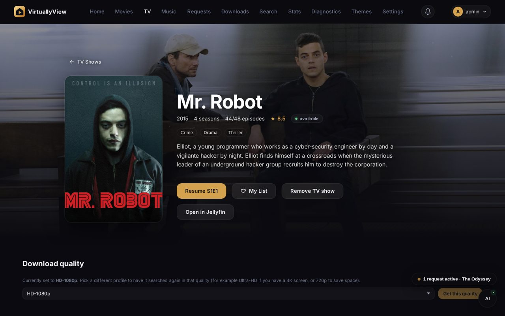
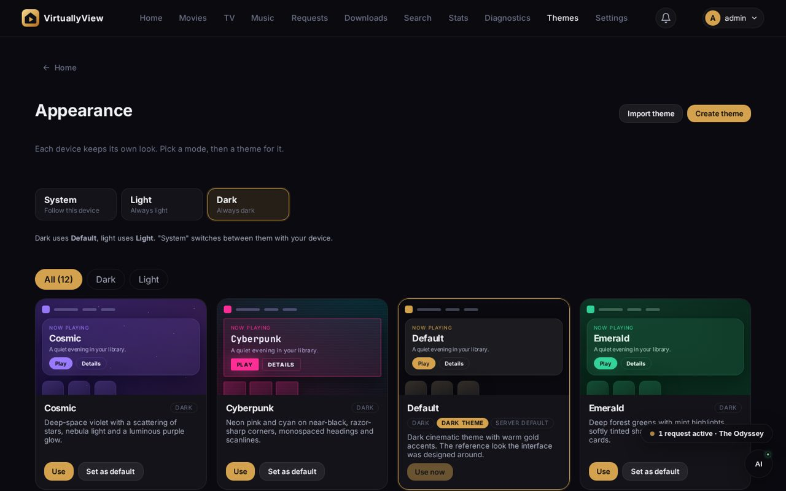
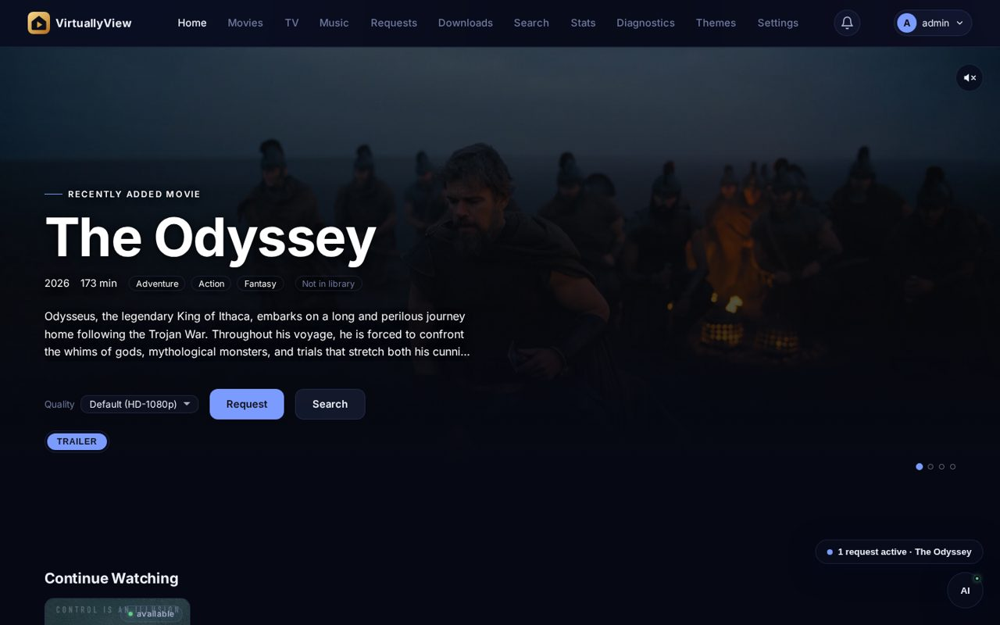
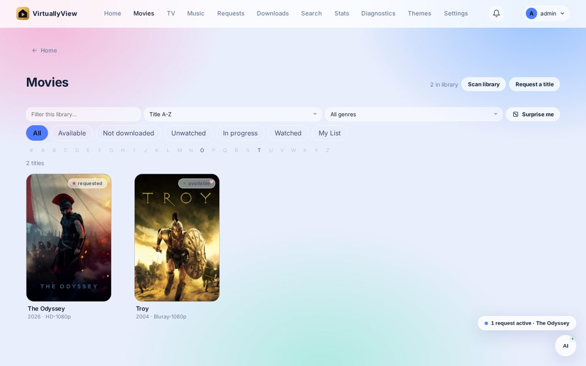

<p align="center">
  
</p>

<p align="center">
  <strong>They rent you the library. Build your own.</strong>
</p>

<p align="center">
  <a href="LICENSE">MIT</a> &middot; <a href="docs/getting-started.md">Getting started</a> &middot; <a href="CONTRIBUTING.md">Contributing</a> &middot; <a href="#feed-the-keep">Feed the keep</a>
</p>

A self-hosted home for your movies, TV shows and music. It puts Radarr, Sonarr, Lidarr, Prowlarr, Bazarr, qBittorrent and NZBGet behind one interface, gives everyone in the house their own account, plays files that browsers normally refuse, and needs no account with anyone outside your network.

**Host it. Change it. Keep the keys.**

<p align="center">
  
</p>

<table>
  <tr>
    <td></td>
    <td></td>
  </tr>
  <tr>
    <td></td>
    <td></td>
  </tr>
  <tr>
    <td></td>
    <td></td>
  </tr>
</table>

## The quiet war

Somewhere a licence expired last night and a film you loved is gone. A price went up. A show you were halfway through moved behind another paywall. An app you paid for changed its rules, and you found out from the notice you clicked past.

None of that is an accident. Renting culture instead of letting you own it is the business model. The catalogue is theirs, the menu is theirs, the record of everything you watch is theirs. You are the tenant, and tenants get notice.

virtuallyView is the other side of that line. One small server in your house. Your library, your accounts and your history in a folder you can copy to a drive and carry away. No account with us, because there is no us holding one. No telemetry. No switch anyone else can flip.

### The Keepers

People who run their own server are called keepers here. Nobody enrols, nothing is sold, and there is no ranking. A keeper is anyone who decided that what they watch and listen to should still be there tomorrow, and who is willing to plug in a box to make it true.

The oath, if you want one:

1. **Host it.** The server lives where you can touch it.
2. **Change it.** The code is MIT. Read it, break it, fork it.
3. **Keep the keys.** Your accounts and your data never leave your hands.
4. **Pass it on.** Set one up for a friend who is still renting.

It does not supply media and it does not replace the tools behind it. It is the interface to the setup you already run, or the one it helps you build. Use media and services you have the right to use.

**Status: early release.** The features below work in the source and were exercised in a browser against the bundled stack, but not every combination of services, formats and devices has been tried. Bug reports with reproduction steps help more than anything else.

## What you get

- **Library.** Movies, TV and music from Radarr, Sonarr and Lidarr, with sort, filters (genre, studio, collection), A-Z jump, Continue Watching, Next Up and a personal My List. Music has lyrics, instant mix and a full track list with missing tracks marked.
- **Player.** Direct play where the browser can, live conversion with ffmpeg where it cannot (MKV, HEVC, DTS). Seek bar with chapter marks, Skip intro and Skip credits, speed, fullscreen, picture in picture, subtitles (sidecar files, text tracks and picture tracks such as PGS), audio track and quality choice while converting, and next episode with an episode picker.
- **Requests.** One search across your library and everything you can request, with posters. Pick the exact match and the quality profile (for example Ultra-HD if you have a 4K screen). Requesting a film that is still in cinemas warns that only camera copies exist and offers to wait for a proper release. Follow progress from search to download to import, and manage failed requests in bulk.
- **Downloads.** The qBittorrent and NZBGet queue, with pause, resume and remove. A setup checklist and one-click public indexers (Settings > Indexers) make sure requests actually find something.
- **Accounts.** Several users, an administrator role, per-person watch progress and lists, profile pictures, age limits per person, a list of signed-in devices, sign in another device with a code, and sign-up closed unless you open it. Optional request approval and per-person limits. Other devices on your network sign in at the same address.
- **Notifications.** A bell in the top bar, desktop pop-ups, and channels for Discord, Slack, Telegram, ntfy, Gotify, webhooks and email.
- **Backups.** Daily automatic backup, one-click download and restore, and an admin command line for when you are locked out.
- **Themes.** Fifteen themes with live previews, chosen per device, plus a theme creator. Light, dark or follow the system.
- **Live TV, photos and books.** Live channels from any M3U playlist, a photo browser with slideshow, and a book shelf. Cast to a TV with Chromecast, AirPlay or DLNA, no account needed ([casting](docs/casting.md)).
- **Optional assistant.** A local model through Ollama that can answer questions and act on your library, with confirmation for anything destructive.
- **Optional proxy.** Route the server's public lookups (metadata, covers, trailers) through Tor, SOCKS5 or HTTP.

### Limits

SABnzbd, Plex and Emby are not supported. virtuallyView plays files itself and needs no other media server. Live TV recording, a programme guide, an EPUB reader and plugins are planned for [phase 2](docs/roadmap.md). Picture subtitles (PGS, VobSub) are drawn onto the video, so they only work while the file is being converted. Missing metadata or an offline service limits what a page can show, and the pages say so.

## Privacy

Self-hosted does not mean nothing leaves the machine.

- Library actions talk to the services you configured. Those services make their own metadata, indexer and download requests.
- Posters, trailers and cast photos are loaded from public sites (TMDB, YouTube, MusicBrainz, Wikipedia). Those sites see the request. The outbound proxy setting can hide the server's own lookups.
- Search suggestions send your query text to Wikipedia. Ollama model downloads need the network; a local model runs inference on your machine.

Read your service settings before pointing this at anything sensitive.

## Quick start

### Docker or Podman (recommended)

```bash
docker compose up -d
```

This starts virtuallyView and a bundled stack: Radarr, Sonarr, Prowlarr, Lidarr, Bazarr, qBittorrent, NZBGet and Ollama. They share a private network, but the ports published on your computer are reachable by anything that can reach it, so read [deployment](docs/deployment.md) before exposing them.

The stack is wired together on first start: root folders and qBittorrent are added to Radarr, Sonarr and Lidarr, and Prowlarr gets the three as applications. The seeded API keys and qBittorrent login are public defaults, listed in [docker/seed/README.md](docker/seed/README.md). Change them before anyone else can reach the ports.

Open http://localhost:3000 and create the first account. It becomes the administrator. Then:

- **Indexers.** Without one, requests find nothing. Add public indexers in one click under Settings > Indexers in virtuallyView (private trackers are added in Prowlarr, http://localhost:9696, with your own login). Choose sources you are entitled to use; none are added for you. The Home page checklist tells you when this is missing.
- **Bazarr.** Open http://localhost:6767, finish its setup, copy the API key and enter the URL and key under Settings > Integrations. Use an address the app container can reach, not `localhost`.

If a root folder or download client is missing after first boot:

```bash
docker compose run --rm provision
```

To run only the app against services you already have:

```bash
docker compose up -d app
```

Then connect them under Settings > Integrations.

A prebuilt image is published for each release at `ghcr.io/<owner>/virtuallyview` if you would rather not build it yourself.

The bundled stack keeps its library and downloads in named volumes, not in this folder. To use an existing library, change the `media-movies`, `media-tv`, `media-music` and `downloads` volumes in `docker-compose.yml` to bind mounts. The *arr containers run as `PUID=0`/`PGID=0` to avoid volume permission trouble; see [the seed guide](docker/seed/README.md) for how to run unprivileged.

On Podman, a few things behave differently after a reboot. See [troubleshooting](docs/troubleshooting.md).

### Other devices

Anyone on your network can open `http://<this-computer's-ip>:3000`. Add their accounts under Settings > Users, or switch on sign-up under Settings > Server. Settings > Server also has the address to share and a note about the firewall.

### From source

Requires Node.js 20 or newer.

```bash
npm install
npm run dev --workspace=apps/server   # API on :3000
npm run dev --workspace=apps/web      # web app on :3001, proxies /api
```

### Assistant (optional)

1. Install Ollama from https://ollama.com and start it with `ollama serve`.
2. Pull a model from Settings > AI Assistant, or run `ollama pull qwen2.5:0.5b`.

The server looks for Ollama at `127.0.0.1:11434`. Inside Docker that address is the container itself, so point it at a reachable host if Ollama runs elsewhere. Small models make mistakes: read what the assistant proposes before you confirm it.

## Commands

| Command | What it does |
| --- | --- |
| `npm run dev --workspace=apps/server` | API server with reload, port 3000 |
| `npm run dev --workspace=apps/web` | Vite dev server, port 3001 |
| `npm run typecheck` | Typecheck server and web |
| `npm run lint` | Lint server and web |
| `npm test` | Unit and integration tests |
| `npm run test:browser` | Browser tests (needs a build and Chromium) |
| `npm run admin -- <command>` | Reset a password, list or promote accounts |
| `npm run build` | Build server and web |
| `npm start --workspace=apps/server` | Production server (also serves the built web app) |

## Layout

```
apps/web/               React + Vite frontend
apps/server/            Fastify API and services
packages/integrations/  Radarr, Sonarr, Prowlarr, Lidarr, Bazarr, qBittorrent, NZBGet adapters
packages/themes/        Theme token schema and validation
packages/ai/            Assistant provider contract and tools
packages/types/         Shared types
themes/                 Bundled themes
docker/seed/            Seed configuration for the bundled stack
scripts/                Setup and provisioning
```

## Documentation

- [Architecture](ARCHITECTURE.md)
- [Getting started](docs/getting-started.md)
- [API](docs/api.md)
- [Requests](docs/requests.md)
- [Integrations](docs/integrations.md)
- [Themes](docs/themes.md)
- [Assistant](docs/ai.md) and [tools](docs/ai-tools.md)
- [Features](docs/features.md)
- [Administration](docs/administration.md): indexers, approvals, notifications, backup, locked-out recovery
- [Casting](docs/casting.md)
- [Roadmap](docs/roadmap.md)
- [HTTPS](docs/https.md) and [reaching it from outside your home](docs/remote-access.md)
- [Development](docs/development.md)
- [Deployment](docs/deployment.md)
- [Troubleshooting](docs/troubleshooting.md)
- [Security](SECURITY.md)

## Tech

React 18, React Router 7, Vite 6, TypeScript, Fastify 5, SQLite (`node:sqlite`), ffmpeg for conversion, optional Ollama. npm workspaces.

## Contributing

Bug reports with steps to reproduce, setup guide fixes, tested integration notes, themes and code are all welcome. See [CONTRIBUTING.md](CONTRIBUTING.md). Never paste credentials or private library details into an issue.

## Feed the keep

The big platforms have advertising budgets, lawyers and thousands of engineers. This project has spare evenings. Every bug fixed, every device tested and every server bill comes out of them.

If virtuallyView is running in your house and has saved you a subscription, add to the fire. Five dollars is a real contribution. Ten is a good month. Nothing is required, and nobody sees who gave.

**What it pays for:** test hardware, hosting, and the time to answer issues and fix things.

**What it buys you:** nothing. No priority, no features, no vote on the roadmap. It buys the project's survival, which is the point.

**Other ways to be a keeper, free:** star the repository, report a bug with steps to reproduce, host one for a friend, or send a fix.

**Why crypto:** no bank, no payment processor and no platform sits between you and a small open project, able to freeze it or take a cut. Bitcoin donations show on the public chain, so anyone can check that the address is live. Monero is private by design. Crypto is irreversible and not an investment: check the address and the network yourself, and send a small test first.

**Bitcoin:**


`bc1q5twatnq2vpqtg3nj86tfzyncxjh42zz2razjhp`

**Monero:**


`45Sb3B4iELhCL8vE1hrN6u9yDyPb5fgcYgXzG9ZKWCWfe4BS7HpLHGpFE2wdka9vutaAkSeNoykvLAx2dQTbcXh4RcLiq8b`

## License

MIT. See [LICENSE](LICENSE).
